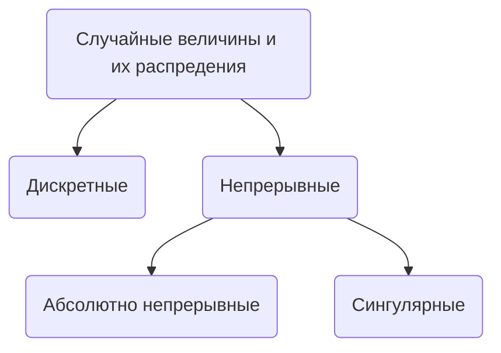

[Запись](https://www.youtube.com/watch?v=vg60gjyKRJg)

----

$(\Omega, \mathcal{F}, \mathbb{P}), \quad A_i \in \mathcal{F}, i \geq1$
$A_\infty  =\{\omega \in \Omega: \omega$ лежит в бесконечном наборе событий среди $A_i\}$ = $\bigcap\limits_{n=1}^\infty \bigcup\limits_{i=n}^\infty A_i$

## Леммы Бореля-Кантелли
1) Если $\sum\limits_{k=1}^\infty\mathbb{P}(A_k) < \infty\quad\Rightarrow\quad\mathbb{P}(A_\infty) = 0$
2) Если $\sum\limits_{k=1}^\infty\mathbb{P}(A_k) = \infty,\: A_i$ [[Независимость событий#Независимость в совокупности и попарно|независимы в совокупности]], то $\mathbb{P}(A_\infty) = 0$

### Доказательство 2
$\mathbb{P}(A_\infty^c) = \mathbb{P}(\bigcup\limits_{n=1}^\infty \bigcap\limits_{i=n}^\infty A_i^c) \leq \sum\limits_{n=1}^\infty\mathbb{P}(\bigcap\limits_{i=n}^\infty A_i^c)$ [[Независимость событий|=]] $\sum\limits_{n=1}^\infty\prod\limits_{i=1}^\infty\mathbb{P}(A_i^c)$ 
Так как $\sum\limits_{i=n}^\infty\mathbb{P}(A_i) =\infty,$ то $\prod\limits_{i=n}^\infty\mathbb{P}(A_i^c) = 0$

> [!NOTE] Действительно
> $$\ln \sum\limits_{i=n}^\infty\mathbb{P}(A_i^c)=\sum\limits_{i=n}^\infty\ln\mathbb{P}(A_i^c) = \sum\limits_{i=n}^\infty\ln(1-\mathbb{P}(A_i)) \leq - \sum\limits_{i=n}^\infty\mathbb{P}(A_i) = -\infty$$
> > [!tip]
> >$\ln(1-x)\leq -x,\quad x\in[0,1)$

Следовательно $\mathbb{P}(A_\infty^c) = 0\quad \Rightarrow\quad \mathbb{P}(A_\infty) = 0$ 

### Пример
Печатаем случайный текст $T$
$B = \{$ напечатаем Войну и Мир $\}$
|ВиМ| = N
$A_1 = \{T_1,T_2,\dots,T_N =$ ВиМ $\}$ - первые N букв совпадают с ВиМ
$A_i = \{T_{(i-1)N+1},\dots,T_{iN} =$ ВиМ $\}$ - i-ый блок из N букв совпадают с ВиМ
$\mathbb{P}(A_i) = \frac{1}{m^N}>  0$
$\sum\limits_{i=1}^\infty\mathbb{P}(A_i) = \infty$
$\mathbb{P}(A_\infty) = 1$ - вероятность того, что напечатаем ВиМ $\infty$ раз

> [!question] Задача
> $\mathbb{P}(\sum\limits_{n=1}^\infty\frac{\xi_n}{n} < \infty) = 1,\quad \xi_n -$ 1 или -1 c вероятностью 1/2
> 

----
## Случайные величины

### "Определение"
Пусть $\Omega$ - не более, чем счетное множество, $(\Omega, 2^\Omega,\mathbb{P})$
Функция $\xi: \Omega \to  \mathbb{R}$ называется случайной величиной
#### Пример
[[Независимость событий|Независимые]] броски $n \geq1$ монеток с вероятностью орла $= 0 \leq p \leq 1$
Сколько выпало орлов?

$\Omega = \{\omega = (\omega_1,\dots,\omega_n): \omega_j = 1,0\}$
$\mathbb{P}(\omega) = p^{\sum\omega_j}(1-p)^{n-\sum\omega_j}$
$\xi(\omega) = \sum\omega_j$ - случайная величина, выражающая число орлов

$\mathbb{P}\{\omega\in\Omega:\xi(\omega)=k\} =: \mathbb{P}\{\xi = k\} = C_n^k p^k(1-p)^{n-k}$ - набор таких вероятностей называется распределением случайной величины (В данном случае это биномиальное распределние = $Binomial(n,p)$)

> [!info] 
> Зачастую мы будем нуждаться **только** в распределении

### Зачем выбрали такое вероятностное пространство

Кажется, можно было бы выбрать сразу [[Вероятностное пространство]], адаптированное под условие задачи:

$\hat{\Omega} = \{1,2,\dots,n\}$
$\mathbb{P}(k) = C_n^k p^k(1-p)^{n-k}$

> [!check] Ответ на вопрос
> Если нас интересует не только случайная величина, то бывает удобно...

### Определение

$(\Omega, \mathcal{F},\mathbb{P})$
$\mathcal{F}/\mathcal{B}(\mathbb{P})$-[[Измеримая функция]] $\xi: \Omega \to  \mathbb{R}$ называется случайной величиной

#### Зачем измеримость?
Мы бы хотели вычислять вероятность $\mathbb{P}(\xi \in A) = \mathbb{P}(\xi^{-1}(A)),\quad A \in \mathcal{B}(\mathbb{R})$
Чтобы $\mathbb{P}(\xi^{-1}(A))$ была определена, нужно чтобы $\xi^{-1}(A) \in\mathcal{F}$

### Распределение

![[Лекция 6 2024-09-30 23.48.45.excalidraw.svg]]

$\xi_{*}(\mathbb{P}) -$ перенесенная отображением $\xi$ [[Мера|мера]] на $(\mathbb{R}, \mathcal{B}(\mathbb{R}))$
$\xi_{*}(\mathbb{P})(A) = \mathbb{P}(\xi^{-1}(A)) = \mathbb{P}(\xi \in A)$
$A \in \mathcal{B}(\mathbb{R})$ 

### Определение
Вероятностная [[Мера|мера]] $\mathbb{P}_\xi := \xi_*(\mathbb{P})$ на $(\mathbb{R}, \mathcal{B}(\mathbb{R}))$ называется распределением случайной величины $\xi$

> [!question] Почему вероятностная
> $\mathbb{P}_\xi(\mathbb{R}) = \mathbb{P}(\xi \in\mathbb{R}) = 1$

> [!NOTE] Случайная величина
> Не обязательно $\xi: \Omega \to  \mathbb{R}$
> Может быть $\to \mathbb{R}^n,\:\to\mathbb{C},\: \to X$ -измеримое
> $\to \mathbb{R}^n$ - случайный вектор

### пупупу

$\xi$ - случайная величина $\quad(\Omega, \mathcal{F}, \mathbb{P})$
$\xi$ определяет новое [[Вероятностное пространство]] $(\mathbb{R},\mathcal{B}(\mathbb{R}), \mathbb{P}_\xi)$

> [!NOTE] Вопрос
> Дана вероятностная [[Мера|мера]] $\mu$ на $(\mathbb{R},\mathcal{B}{\mathbb{R}})$
> Можно ли построить $\xi$, такую что $\mathbb{P}_\xi=\mu$?

$(\Omega,\mathcal{F},\mathbb{P}) = (\mathbb{R}, \mathcal{B}(\mathbb{R}),\mu),\quad \xi(x) := x$

$\mathbb{P}(\xi \in A) = \mathbb{P}(x:\xi(x)\in A)) = \mathbb{P}(x:x\in A)=\mu(A)$

$[a,b]$
$\xi: \mathbb{P}(A) = \frac{leb(A\cap[a,b])}{b-a}$
$\xi$ - координата точки, случайно брошенной на $[a,b]$
Равномерное распределение на $[a,b] = Uniform([a,b])$

### Типы распределений

### Дискретные случайные величины

#### "Определение"
$\xi -$ дискретная случайная величина, если $\xi$ принимает не более, чем счетное число значений.
#### Определение
$\exists$ не более чем счетный набор , такой что
$\mathbb{P}(\xi\in A) = \sum\limits_{j: x_j\in A}\mathbb{P}(\xi = x_j)$
$\forall A \in \mathcal{B}(\mathbb{R})$

> [!NOTE] Замечание
> Дискретные распределения удобно записывать таблицей:
> | $\xi$            | $x_1$ | $x_2$ | $x_3$ |
> | ---------------- | ----- | ----- | ----- |
> | $\mathbb{P}_\xi$ | $p_1$ | $p_2$ | $p_3$ |
>

