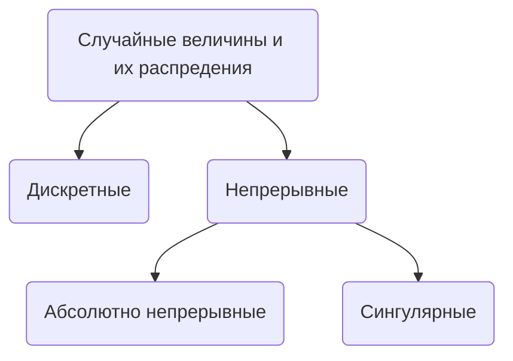

![[Лекция 6 2024-09-30 23.48.45.excalidraw.svg]]

$\xi_{*}(\mathbb{P}) -$ перенесенная отображением $\xi$ [[Мера|мера]] на $(\mathbb{R}, \mathcal{B}(\mathbb{R}))$
$\xi_{*}(\mathbb{P})(A) = \mathbb{P}(\xi^{-1}(A)) = \mathbb{P}(\xi \in A)$
$A \in \mathcal{B}(\mathbb{R})$ 

### Определение
Вероятностная [[Мера|мера]] $\mathbb{P}_\xi := \xi_*(\mathbb{P})$ на $(\mathbb{R}, \mathcal{B}(\mathbb{R}))$ называется распределением случайной величины $\xi$

> [!question] Почему вероятностная
> $\mathbb{P}_\xi(\mathbb{R}) = \mathbb{P}(\xi \in\mathbb{R}) = 1$

> [!NOTE] Случайная величина
> Не обязательно $\xi: \Omega \to  \mathbb{R}$
> Может быть $\to \mathbb{R}^n,\:\to\mathbb{C},\: \to X$ -измеримое
> $\to \mathbb{R}^n$ - случайный вектор
### Типы распределений

